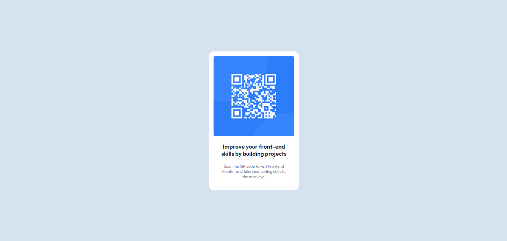

# Frontend Mentor: solución de componentes de código QR

Esta es una solución al [desafío del componente de código QR en Frontend Mentor](https://www.frontendmentor.io/challenges/qr-code-component-iux_sIO_H).

## Descripción general

### El reto

El desafío es construir este componente de código QR y lograr que se parezca lo más posible al diseño.

### Captura de pantalla

### Previsualización

https://jragx.github.io/qr-code-component/

### Construido con

-   HTML5
-   CSS
-   flexbox
